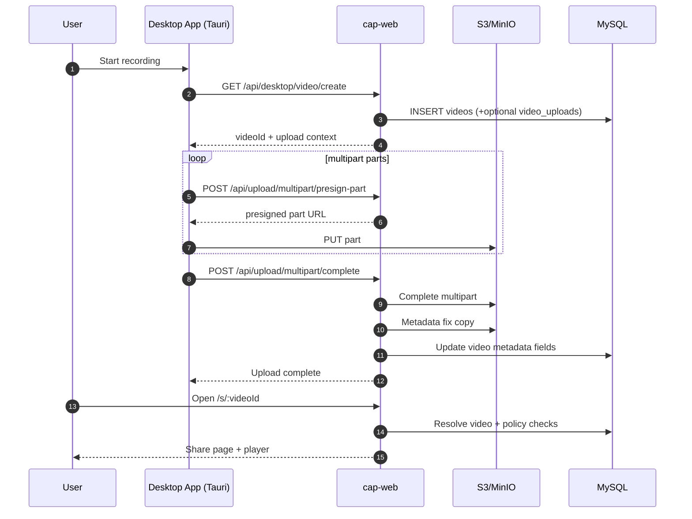
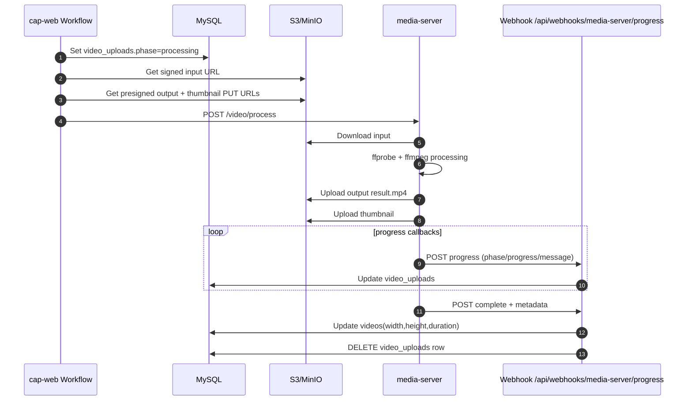
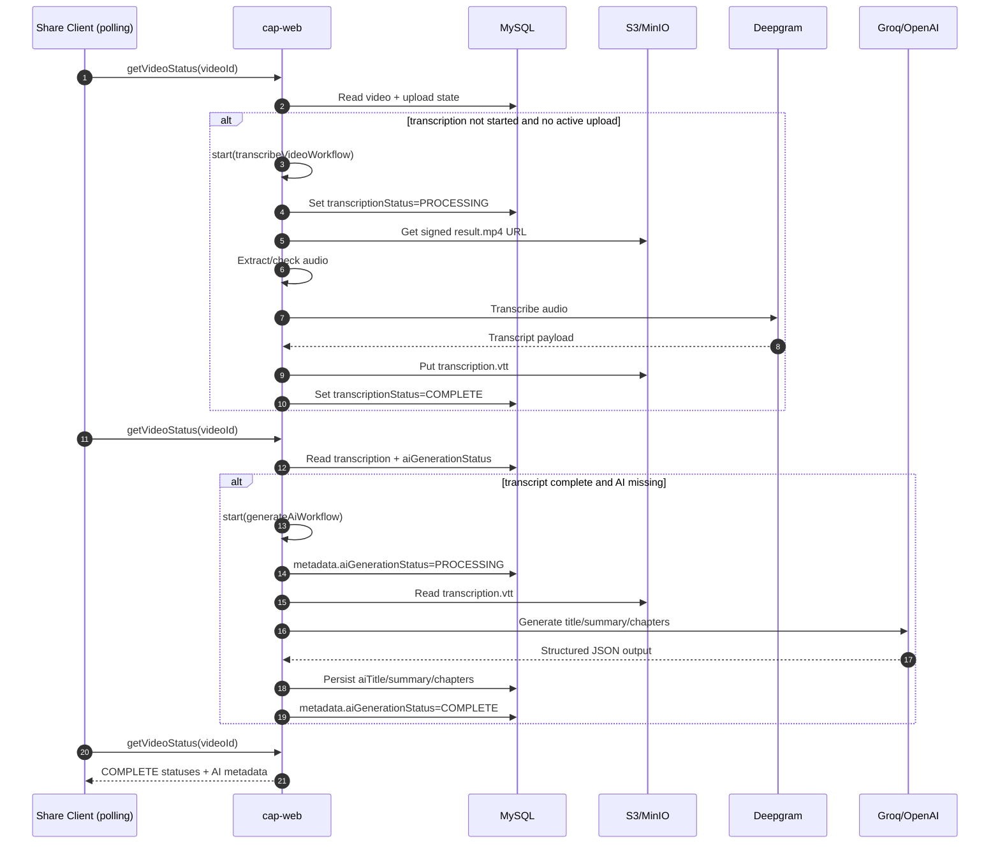
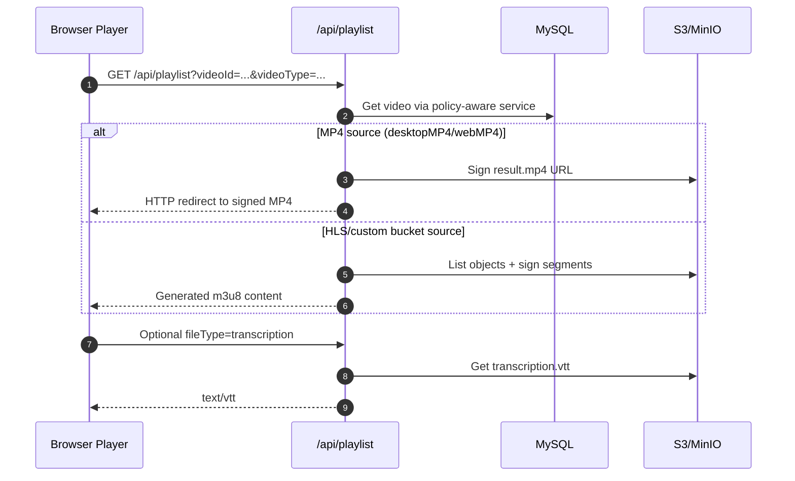
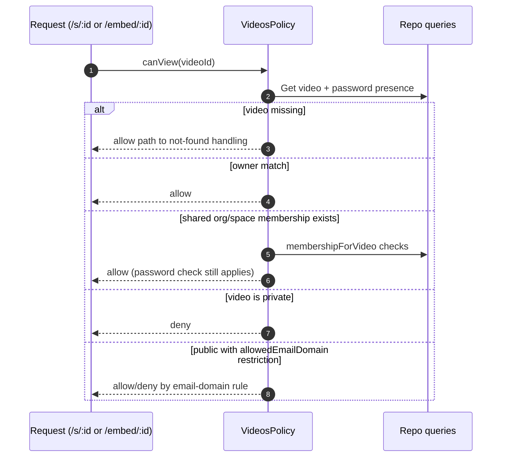

# Cap Master Architecture Guide

This document is a deep technical map of the Cap codebase at `/apps/Cap`.
It is written so an engineer can:

1. Understand how Cap works end-to-end.
2. Operate and debug a self-hosted deployment.
3. Recreate a similar product architecture from first principles.

## 1. Scope and Mental Model

Cap is a **cross-platform screen recording product** with:

- A native desktop recorder/editor (`apps/desktop`, Tauri + Rust + SolidStart).
- A web application for viewing, sharing, import, account/workspace management (`apps/web`, Next.js).
- A media processing service for server-side FFmpeg/FFprobe jobs (`apps/media-server`, Bun + Hono).
- Shared domain/service layers (`packages/web-domain`, `packages/web-backend`, `packages/database`).
- A large Rust media stack in `crates/*` reused by desktop, CLI, and rendering/export paths.

At a high level:

1. Capture/upload creates a `videos` row and stores media in S3-compatible object storage.
2. Playback routes (`/s/:videoId`, `/embed/:videoId`) resolve a signed source URL or generated playlist.
3. Transcript and AI summary/chapter generation run as async workflows.
4. Authorization and sharing are enforced by policy services, not ad-hoc route logic.

## 2. Monorepo Topology

### 2.1 Apps (`/apps`)

- `web`: Next.js app for sharing, dashboard, APIs, workflows, auth.
- `desktop`: Tauri app with SolidStart frontend and Rust backend commands.
- `media-server`: FFmpeg/FFprobe processing microservice.
- `cli`: Rust CLI for recording/export operations against the same media crates.
- `web-cluster`: Workflow cluster/shard manager runtime.
- `discord-bot`: Cloudflare worker for release automation.
- `storybook`: UI preview app.

### 2.2 Shared Packages (`/packages`)

- `database`: Drizzle schema, migrations, auth adapter/session helpers.
- `env`: runtime and build-time environment validation.
- `ui`, `ui-solid`: shared component libraries.
- `utils`: shared app utilities.
- `web-domain`: domain types, errors, policies, RPC/HTTP contracts.
- `web-backend`: effect services (Videos, Policies, S3, Tinybird, Loom workflows).
- `web-api-contract`, `web-api-contract-effect`: contract layers.
- `local-docker`, `s3`, `config`, `tsconfig`: local tooling and shared config.

### 2.3 Rust Crates (`/crates`)

Key groups:

- Capture/recording: `recording`, `camera*`, `scap-*`, `audio`, `cursor-*`, `timestamp`.
- Encoding/decoding/rendering: `enc-*`, `video-decode`, `rendering`, `rendering-skia`, `export`, `ffmpeg-hw-device`, `frame-converter`, `gpu-converters`.
- Project/data model helpers: `project`, `editor`, `media-info`, `media`.
- Test and support: `cap-test`, `utils`, `fail`, `workspace-hack`.

## 3. Runtime Service Topology

### 3.1 Self-host (Docker Compose)

From `docker-compose.yml`:

- `cap-web` (Next.js): serves UI + API + workflow endpoints.
- `media-server` (Bun): server-side video/audio processing.
- `mysql`: primary relational DB.
- `minio`: S3-compatible object storage.
- `minio-setup`: creates bucket and access policy bootstrap.

Internal network: `cap-network`.

Core service links:

- `cap-web` -> MySQL (`DATABASE_URL`).
- `cap-web` -> MinIO/S3 (`S3_INTERNAL_ENDPOINT`, `S3_PUBLIC_ENDPOINT`).
- `cap-web` -> `media-server` (`MEDIA_SERVER_URL`).
- `media-server` -> presigned S3 URLs returned by `cap-web` workflow logic.
- `media-server` -> webhook callback into `cap-web` (`/api/webhooks/media-server/progress`).

### 3.2 Cap Cloud / managed style

From `infra/sst.config.ts` and web config:

- Web on Vercel.
- Recordings on S3 (optionally CloudFront signed URL path).
- Tinybird for analytics ingestion/query.
- Optional workflow cluster (`WORKFLOWS_RPC_URL`, `WORKFLOWS_RPC_SECRET`) for remote workflow execution.

### 3.3 Reverse proxy expectations (Nginx/edge)

Cap itself does not require special websocket routing for core flows, but large uploads require proxy settings that avoid premature termination.

If fronting Cap with Nginx, ensure:

- Preserve `Host`, `X-Forwarded-Proto`, `X-Forwarded-For`.
- Allow large request bodies and longer timeouts for upload endpoints.
- Avoid buffering behavior that breaks large streamed uploads.
- TLS terminate at proxy and forward to `cap-web`.
- Domain and `NEXTAUTH_URL`/`WEB_URL` must match externally visible URL.

## 4. Core Tech Stack

### 4.1 Web and backend runtime

- Next.js App Router (`apps/web/app/*`).
- `@effect/platform` + `effect` for typed service layers and API handlers.
- Hono for grouped route families (`/api/upload`, `/api/desktop`).
- NextAuth with Drizzle adapter for user auth.
- Drizzle ORM for MySQL data access.
- Workflow runtime via `workflow/next` + `workflow/api` (`start(...)` calls).

### 4.2 Desktop runtime

- Tauri v2 shell.
- SolidStart frontend.
- Rust command/event boundary generated by `tauri-specta` (`apps/desktop/src/utils/tauri.ts`).
- Rust FFmpeg/capture/render stack in crates.

### 4.3 Media and AI providers

- FFmpeg/FFprobe for processing/transcoding/probing.
- Deepgram for transcription.
- Groq and OpenAI fallback for summary/chapter/title generation.
- Optional Replicate path for audio enhancement hooks.

## 5. Data Model and Domain Entities

Primary schema file: `packages/database/schema.ts`.

### 5.1 Identity and tenancy

- `users`: identity, subscription/billing metadata, preferences, active/default org.
- `accounts`, `sessions`, `verification_tokens`: auth/session materialization.
- `auth_api_keys`: API-key style desktop auth option.
- `organizations`: tenant root, settings, optional domain restrictions.
- `organization_members`, `organization_invites`: org membership lifecycle.

### 5.2 Collaboration containers

- `spaces`: scoped collaboration units in an org (`Public`/`Private`).
- `space_members`: user membership in spaces.
- `folders`: hierarchy in org/space contexts.
- `space_videos`: mapping video into space/folder context.
- `shared_videos`: explicit org-level sharing mapping.

### 5.3 Media and processing entities

- `videos`: canonical media record.
- `video_uploads`: upload and processing progress state.
- `imported_videos`: dedupe/source mapping for import pipelines.
- `s3_buckets`: encrypted per-user custom storage credentials.

### 5.4 Interaction entities

- `comments`: time-based or text comments/replies.
- `notifications`: view/comment/reply/reaction notifications.
- `messenger_*`: support/chat channel entities.

### 5.5 Critical `videos` fields

- `source.type`: `MediaConvert` | `local` | `desktopMP4` | `webMP4`.
- `transcriptionStatus`: `PROCESSING` | `COMPLETE` | `ERROR` | `SKIPPED` | `NO_AUDIO`.
- `metadata` (`packages/database/types/metadata.ts`):
  - `aiTitle`, `summary`, `chapters`.
  - `aiGenerationStatus`: `QUEUED` | `PROCESSING` | `COMPLETE` | `ERROR` | `SKIPPED`.

## 6. State Machines

### 6.1 Upload/process state (`video_uploads.phase`)

`uploading -> processing -> generating_thumbnail -> complete` or `error`.

Also tracked:

- Byte counters: `uploaded`, `total`.
- Processing UI state: `processingProgress`, `processingMessage`, `processingError`.
- Source pointer: `rawFileKey` when raw->processed conversion is needed.

### 6.2 Transcription state (`videos.transcriptionStatus`)

- `null` (not started) -> `PROCESSING` -> `COMPLETE`.
- Terminal alternatives: `SKIPPED`, `NO_AUDIO`, `ERROR`.

### 6.3 AI generation state (`videos.metadata.aiGenerationStatus`)

- `null` (not started) -> `QUEUED` -> `PROCESSING` -> `COMPLETE`.
- Terminal alternatives: `SKIPPED`, `ERROR`.

### 6.4 Media server job state (in-memory job manager)

`queued -> downloading -> probing -> processing -> uploading -> generating_thumbnail -> complete/error/cancelled`.

## 7. Authorization and Access Model

Primary policy implementation: `packages/web-backend/src/Videos/VideosPolicy.ts`.

Access checks for a video are centralized and reusable:

1. Owner always allowed.
2. Shared org membership and shared space membership grant access.
3. Otherwise, video must be public.
4. Optional organization email domain restriction can deny even public access if email does not match policy.
5. Password-protected videos require attached password context (`x-cap-password` cookie attachment via `VideoPasswordAttachment`).

This is why major read paths call `Policy.withPublicPolicy(videosPolicy.canView(videoId))` instead of rolling custom logic.

## 8. Auth and Session Flows

### 8.1 Web auth

NextAuth setup in `packages/database/auth/auth-options.ts`:

- Providers: Credentials, Email OTP, Google, WorkOS.
- Session strategy: JWT.
- Sign-in page: `/login`.
- Signup domain allowlist support (`CAP_ALLOWED_SIGNUP_DOMAINS`).
- In self-host mode without email provider, OTP codes are logged to server output.

### 8.2 Desktop auth handshake

Desktop endpoint family: `apps/web/app/api/desktop/[...route]/*`.

`/api/desktop/session/request` can return:

- Session token mode.
- API key mode (`auth_api_keys` row).

Desktop then sends `Authorization: Bearer ...` and `X-Cap-Desktop-Version` via `apps/desktop/src-tauri/src/web_api.rs`.

## 9. Storage and S3 Model

Service: `packages/web-backend/src/S3Buckets/index.ts`.

Behavior:

- Resolves default bucket from env (`CAP_AWS_*`, `S3_*`).
- Optionally resolves user custom bucket (`s3_buckets`) and decrypts credentials.
- Provides signed read/write URLs and multipart helpers via `S3BucketAccess` abstraction.
- Can wrap signed reads with CloudFront signatures if CloudFront env is configured.

Canonical object key convention:

- Video MP4: `{ownerId}/{videoId}/result.mp4`
- Screenshot thumbnail: `{ownerId}/{videoId}/screenshot/screen-capture.jpg`
- Transcript: `{ownerId}/{videoId}/transcription.vtt`
- Temp audio during transcription: `{ownerId}/{videoId}/audio-temp.mp3`

## 10. Playback Path

Playlist endpoint: `apps/web/app/api/playlist/route.ts`.

Behavior by source type:

- `desktopMP4` / `webMP4`: signed redirect to `result.mp4`.
- `MediaConvert`: redirect or generated m3u8 path under output prefix.
- `local`: combined source stream path.
- Custom bucket case can generate master/video/audio playlists dynamically with signed segment URLs.

Also supports:

- `fileType=transcription`: returns `transcription.vtt` text.
- `fileType=enhanced-audio`: returns signed enhanced audio object URL.

## 11. Upload and Ingestion Flows

### 11.1 Desktop recording upload (primary)

Key web endpoint: `GET /api/desktop/video/create` (`apps/web/app/api/desktop/[...route]/video.ts`).

Sequence:

1. Desktop requests/create or reuse video ID and receives metadata context.
2. Desktop uploads via multipart or signed routes (`/api/upload/multipart/*`, `/api/upload/signed`).
3. Desktop periodically reports progress (`/api/desktop/video/progress`).
4. Complete endpoint finalizes multipart upload and metadata repair.
5. Result object is present at `result.mp4` and share URL is immediately valid.

Important nuance:

- Some paths delete `video_uploads` when upload finalizes.
- Some paths leave an `uploading` row that must be interpreted carefully (recent patches in `get-status.ts`, `/s/[videoId]/page.tsx`, `/embed/[videoId]/page.tsx` avoid false-active upload gating by requiring `uploaded < total` or unknown total).

### 11.2 Web upload/import flow

Entry action: `apps/web/actions/video/upload.ts` (`createVideoAndGetUploadUrl`).

Sequence:

1. User creates a video record.
2. App returns presigned post/put URL for final object path.
3. Optional upload progress row is created and updated.
4. Playback page references final stored object.

### 11.3 Loom import flow

- Trigger points: web actions + workflow layer.
- Workflow: `apps/web/workflows/import-loom-video.ts` and `packages/web-backend/src/Loom/ImportVideo.ts`.

Sequence:

1. Validate Loom URL/content access.
2. Create Cap video record.
3. Download source bytes.
4. Upload to configured bucket.
5. Trigger downstream processing/status updates.

## 12. Media Processing Flow (Server-side)

Web workflow: `apps/web/workflows/process-video.ts`.
Media server route: `apps/media-server/src/routes/video.ts`.
Webhook sink: `apps/web/app/api/webhooks/media-server/progress/route.ts`.

Sequence:

1. Web workflow marks `video_uploads.phase=processing`.
2. Generates signed input URL and presigned output URLs.
3. Calls `POST /video/process` on media server.
4. Media server downloads source, probes, transcodes/remuxes, uploads output and thumbnail.
5. Media server sends progress webhooks.
6. Webhook updates DB progress and on completion writes dimensions/duration and deletes `video_uploads` row.

Media server constraints:

- Concurrency throttled by job manager (`MAX_CONCURRENT_VIDEO_PROCESSES = 3`).
- Process timeouts and stderr capture are enforced.

## 13. Transcription Flow

Trigger surfaces:

- `apps/web/actions/videos/get-status.ts`.
- `/s/[videoId]` and `/embed/[videoId]` page server logic.
- Retry endpoint: `/api/videos/[videoId]/retry-transcription`.

Execution:

- Launcher: `apps/web/lib/transcribe.ts`.
- Workflow: `apps/web/workflows/transcribe.ts`.

Sequence:

1. Validate video existence and transcription config (`DEEPGRAM_API_KEY`, org/video settings).
2. Set `transcriptionStatus=PROCESSING`.
3. Resolve signed `result.mp4` URL.
4. Check/extract audio (media-server path if configured, local extraction fallback otherwise).
5. Upload temp audio object and call Deepgram (`nova-3`).
6. Convert response to WebVTT and store at `transcription.vtt`.
7. Set status `COMPLETE`.
8. Cleanup temp audio.
9. Optionally queue AI generation.

Failure/terminal branches:

- No audio -> `NO_AUDIO`.
- Transcript disabled -> `SKIPPED`.
- Runtime error -> `ERROR`.

## 14. AI Summary/Title/Chapter Flow

Trigger surfaces:

- `get-status` when transcript is complete and AI not generated.
- Manual endpoints: `/api/video/ai`, `/api/videos/[videoId]/retry-ai`.

Execution:

- Launcher: `apps/web/lib/generate-ai.ts`.
- Workflow: `apps/web/workflows/generate-ai.ts`.

Sequence:

1. Validate API key availability (Groq or OpenAI fallback).
2. Validate transcription complete and no existing final AI metadata.
3. Set `aiGenerationStatus=PROCESSING`.
4. Read `transcription.vtt` from S3.
5. Parse segments and chunk large transcripts.
6. Call Groq model (`GROQ_MODEL`) with JSON output contract, fallback to OpenAI if needed.
7. Merge outputs into `{ aiTitle, summary, chapters }`.
8. Persist metadata and set `aiGenerationStatus=COMPLETE`.
9. Optionally rename default title-like video names with AI title.

Skip branch:

- Empty/too short transcript -> `SKIPPED`.

## 15. Share Page and Polling Mechanics

Primary route: `apps/web/app/s/[videoId]/page.tsx` and client `Share.tsx`.

`Share.tsx` behavior:

- Polls `getVideoStatus` to drive transcript and AI UI state.
- Stops or slows polling based on terminal statuses.
- Sends page-hit analytics to `/api/analytics/track`.

Current stabilization logic:

- Active uploads are considered active only when genuinely in-progress (`uploaded < total` or unknown total + recent) to prevent stale rows from blocking transcription.

## 16. Analytics and Telemetry

Primary sink:

- Client beacon/fetch from share page to `/api/analytics/track`.
- Service writes to Tinybird (`packages/web-backend/src/Tinybird/index.ts`).

Use cases:

- View counts and dashboard analytics.
- Materialized view query path with fallback raw SQL query path.

Additional telemetry:

- Desktop sends logs/diagnostics to `/api/desktop/logs` and feedback endpoints.
- PostHog events in desktop upload pipeline.

## 17. Desktop App Architecture

Key files:

- Rust entry/state: `apps/desktop/src-tauri/src/lib.rs`.
- Recording orchestration: `apps/desktop/src-tauri/src/recording.rs`.
- Upload orchestration: `apps/desktop/src-tauri/src/upload.rs`.
- API session/request layer: `apps/desktop/src-tauri/src/web_api.rs`.
- Generated TS command bridge: `apps/desktop/src/utils/tauri.ts`.

Design:

- SolidStart renders UI windows/routes (`apps/desktop/src/routes/*`).
- Tauri command handlers execute native operations and emit progress events.
- Rust side owns recording actors, feed lifecycles (camera/mic/system audio), export, upload, permissions, auth store.

Two recording modes:

- `Instant`: progressive multipart upload while recording completes.
- `Studio`: richer post-processing/editing flow before export/upload.

## 18. Rust Media Pipeline Summary

Core crate: `crates/recording`.

Pipeline building blocks:

- Capture sources: display/window/camera/mic/system audio.
- Output pipeline and muxing through FFmpeg encoders (`cap_enc_ffmpeg` path).
- Rendering/export through `crates/rendering` + `crates/export`.

This architecture allows:

- Shared engine across desktop and CLI.
- Consistent metadata and output conventions.
- Platform-specific capture backends isolated to dedicated crates.

## 19. API Surface Organization

`apps/web/app/api` is not one style; it mixes patterns intentionally.

Pattern A: Next route handlers

- Example: `/api/video/ai`, `/api/videos/[videoId]/retry-ai`, `/api/video/metadata`.

Pattern B: Hono grouped routers

- `/api/upload/[...route]` (`signed`, `multipart`).
- `/api/desktop/[...route]` (session, s3 config, video, root utilities).

Pattern C: Effect HttpApi handlers

- `/api/[[...route]]` uses `HttpLive` and typed contracts.
- `/api/playlist` uses typed effect API layer.

Pattern D: Effect RPC

- `/api/erpc` uses `RpcsLive` + auth middleware.

## 20. Workflow Runtime Integration

Web build uses workflow plugin in `apps/web/next.config.mjs` (`withWorkflow`).

Workflows invoked from app code:

- `start(transcribeVideoWorkflow, [...])`
- `start(generateAiWorkflow, [...])`
- `start(processVideoWorkflow, [...])`
- `start(importLoomVideoWorkflow, [...])`

Workflow endpoints are exposed under `/.well-known/workflow/v1/*`.

Optional remote workflow cluster support exists via `WORKFLOWS_RPC_URL` and `apps/web-cluster` runner.

## 21. Environment Configuration Matrix

Validated in `packages/env/server.ts` and `packages/env/build.ts`.

Minimum self-host core:

- `DATABASE_URL`
- `WEB_URL`, `NEXTAUTH_URL`, `NEXTAUTH_SECRET`
- `CAP_AWS_BUCKET`, `CAP_AWS_REGION`
- S3 credentials/endpoints for your storage mode

Common optional but important:

- `DEEPGRAM_API_KEY` for transcript.
- `GROQ_API_KEY` or `OPENAI_API_KEY` for summary/chapter/title.
- `MEDIA_SERVER_URL` and webhook settings for processing flow.
- `RESEND_*` for email OTP delivery.
- `TINYBIRD_*` for analytics.

## 22. Build, Dev, and Test Workflow

From root `package.json` + `turbo.json`:

- Install: `pnpm install`
- Setup: `pnpm env-setup` then `pnpm cap-setup`
- Dev all: `pnpm dev`
- Web only: `pnpm dev:web`
- Desktop only: `pnpm dev:desktop`
- Build all: `pnpm build`
- Build web: `pnpm build:web`
- DB: `pnpm db:generate` then `pnpm db:push`
- Format/lint/typecheck: `pnpm format`, `pnpm lint`, `pnpm typecheck`

Rust-targeted checks:

- `cargo build -p <crate>`
- `cargo test -p <crate>`

## 23. Operational Debug Playbook

When a video appears broken, inspect in this order:

1. `videos` row: `source`, `transcriptionStatus`, `metadata.aiGenerationStatus`, dimensions/duration.
2. `video_uploads` row: `phase`, `uploaded/total`, `processing_*` fields.
3. Object existence in S3/minio:
   - `result.mp4`
   - screenshot
   - `transcription.vtt` if transcript expected.
4. `cap-web` logs for trigger lines:
   - `[ShareVideoPage] Starting transcription...`
   - `[transcribeVideo] Triggering transcription workflow...`
5. `media-server` logs for processing job lifecycle if source requires processing.
6. Browser console/network for 404 on presigned `result.mp4` URLs.

Common failure classes:

- Upload never finalized or stale upload row blocks trigger.
- Transcript disabled by org/video settings.
- Missing provider keys (Deepgram/Groq/OpenAI).
- Presigned URL points to missing object (incomplete upload or wrong key).

## 24. “Build a Similar App” Blueprint

If rebuilding a similar product, replicate these architecture decisions:

### 24.1 Separate concerns by runtime

- Native client for capture/edit UX and local performance constraints.
- Web app for sharing/distribution/account/workspace logic.
- Dedicated media worker service for expensive FFmpeg jobs.

### 24.2 Adopt explicit state tables

- Keep upload/processing state in dedicated table (`video_uploads`).
- Keep transcript/AI state on primary video row.
- Use deterministic key conventions in object storage.

### 24.3 Centralize authorization policy

- Create policy services (`VideosPolicy`, `SpacesPolicy`, etc.).
- Make handlers call policy, not custom ad-hoc checks.
- Add domain-level password/email-domain restrictions as first-class logic.

### 24.4 Use async workflows for long jobs

- Trigger from request/UI, execute separately.
- Persist statuses incrementally so UI can poll.
- Keep retry endpoints for operators/users.

### 24.5 Use a storage abstraction layer

- Support default bucket and per-user custom bucket.
- Keep signed URL generation and endpoint style concerns in one service.

### 24.6 Build for observability

- Structured progress logging in upload + workflow + media service.
- Distinct status fields for every stage.
- Analytics sink separated from transactional DB.

## 25. Critical File Index

System entry points:

- `README.md`
- `docker-compose.yml`
- `apps/web/next.config.mjs`
- `packages/env/server.ts`

Web core:

- `apps/web/app/s/[videoId]/page.tsx`
- `apps/web/app/s/[videoId]/Share.tsx`
- `apps/web/actions/videos/get-status.ts`
- `apps/web/lib/transcribe.ts`
- `apps/web/lib/generate-ai.ts`
- `apps/web/workflows/transcribe.ts`
- `apps/web/workflows/generate-ai.ts`
- `apps/web/workflows/process-video.ts`
- `apps/web/app/api/playlist/route.ts`
- `apps/web/app/api/upload/[...route]/multipart.ts`
- `apps/web/app/api/upload/[...route]/signed.ts`
- `apps/web/app/api/webhooks/media-server/progress/route.ts`

Desktop core:

- `apps/desktop/src-tauri/src/lib.rs`
- `apps/desktop/src-tauri/src/recording.rs`
- `apps/desktop/src-tauri/src/upload.rs`
- `apps/desktop/src-tauri/src/web_api.rs`
- `apps/desktop/src/utils/tauri.ts`

Media server core:

- `apps/media-server/src/app.ts`
- `apps/media-server/src/routes/video.ts`
- `apps/media-server/src/lib/ffmpeg-video.ts`
- `apps/media-server/src/lib/job-manager.ts`

Domain/data core:

- `packages/database/schema.ts`
- `packages/database/types/metadata.ts`
- `packages/database/auth/auth-options.ts`
- `packages/web-domain/src/Video.ts`
- `packages/web-backend/src/Videos/index.ts`
- `packages/web-backend/src/Videos/VideosPolicy.ts`
- `packages/web-backend/src/S3Buckets/index.ts`
- `packages/web-backend/src/Workflows.ts`

## 26. Practical Notes for This Repository Snapshot

- There are both legacy and newer flow paths in parallel (desktop compatibility, route style mix).
- Upload state handling has been an active area; stale `video_uploads` interpretation can suppress transcription/AI auto-start if not gated carefully.
- The architecture is intentionally hybrid: Next route handlers, Hono route groups, Effect APIs, and RPC coexist by domain needs.

This hybrid style is powerful but requires strict discipline around policy checks, status fields, and shared service boundaries.

## 27. Sequence Diagrams (Mermaid)

These diagrams model the dominant production paths.

### 27.1 Desktop Recording Upload to Share Page

### 27.2 Raw Upload Processing Through Media Server

### 27.3 Transcript and AI Generation

### 27.4 Playback Source Resolution

### 27.5 Authorization Decision Path

## 28. Companion Runbook

For fast operations and incident response, use `operator_runbook_by_codex.md`.
Use this master guide for architecture depth, and the runbook for fast triage/recovery actions.
